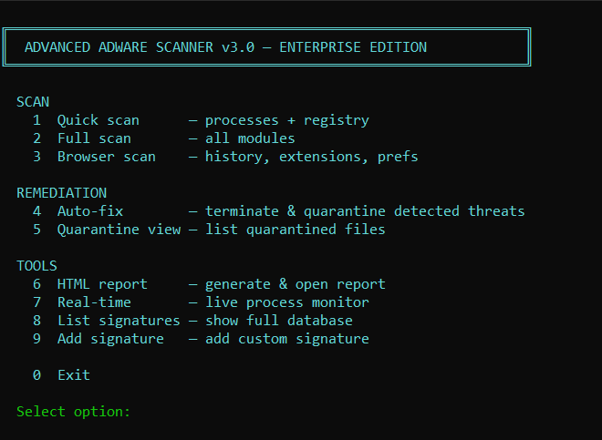

# Advanced Adware & Browser Hijacker Scanner v3.0

A fully functional, cross-platform adware and browser hijacker scanner with auto-remediation, written in pure Python. No antivirus subscription required.


---

## Features

- **Process scanner** — detects adware/hijacker processes currently running in memory
- **Registry scanner** — checks Windows startup keys for known malicious entries
- **Browser scanner** — reads Chrome, Edge, Brave, and Firefox config files, extensions, and browsing history
- **Network scanner** — flags active connections to suspicious ports
- **Hosts file scanner** — detects hijacked `/etc/hosts` or `C:\Windows\System32\drivers\etc\hosts` entries
- **Filesystem scanner** — scans Downloads, Temp, and ProgramData for known malicious filenames
- **Auto-remediation** — terminates malicious processes, quarantines files (encrypted), logs registry items for manual removal
- **Encrypted quarantine** — quarantined files are AES-encrypted via `cryptography.fernet`; restore with one command
- **HTML reports** — generates a colour-coded scan report you can save and share
- **Real-time monitor** — watches for new processes every 2 seconds
- **Custom signatures** — add your own patterns via the interactive menu or `--add-sig` CLI flag
- **VirusTotal integration** (optional) — provide your own API key to check file hashes

---

## Signature Database

The scanner ships with **30+ verified signatures** covering:

| Category | Examples |
|---|---|
| Browser Hijackers | SweetPage, Babylon Toolbar, Conduit, Safe Finder, Search Baron, Searchlee, Search Marquis |
| Adware | SuperFish, Fireball, Crossrider, Yontoo, Adrozek, SmartBar |
| PUPs | Mindspark/MyWay, OpenCandy, InstallCore, SpeedUpMyPC, Reimage Repair |
| Trackers | DoubleClick, Outbrain |

All signatures are sourced from verified security vendors including Malwarebytes, Trend Micro, BleepingComputer, PCRisk, and Microsoft Security Intelligence.

---

## Installation

```bash
# Clone the repo
git clone https://github.com/wilshwez/adware-scanner.git
cd adware-scanner

# Install optional dependencies (scanner works without them, features degrade gracefully)
pip install psutil requests cryptography
```

**Dependency breakdown:**

| Package | Used for | Required? |
|---|---|---|
| `psutil` | Process scan, network scan, real-time monitor | Optional |
| `requests` | VirusTotal hash lookup | Optional |
| `cryptography` | Encrypted quarantine | Optional |

> **Note:** `yara-python` has been intentionally removed from this project. It is incompatible with Python 3.13 on Windows and is not required for core functionality.

---

## Usage

### Interactive menu (default)
```bash
python adware_scanner.py
```

## Screenshot



### Command-line flags
```bash
# Quick scan (processes + registry)
python adware_scanner.py --quick

# Full scan (all modules)
python adware_scanner.py --full

# Full scan + save HTML report
python adware_scanner.py --full --report

# Check a specific string or URL
python adware_scanner.py --target "sweetpage.com"

# List all loaded signatures
python adware_scanner.py --list-sigs

# Add a custom signature
python adware_scanner.py --add-sig "MyThreat" "mybadsite.com" "hijacker" "threat" "Custom entry"
```

### Run as administrator
For full registry, network, and hosts file access, run with elevated privileges:

```bash
# Windows (run PowerShell as Administrator)
python adware_scanner.py --full

# macOS / Linux
sudo python3 adware_scanner.py --full
```

---

## Adding Custom Signatures

You can add your own detection patterns interactively (menu option `9`) or via the CLI:

```bash
python adware_scanner.py --add-sig "ThreatName" "pattern-to-match" "adware" "threat" "Description"
```

Custom signatures are saved to `custom_signatures.json` in the same directory and are loaded automatically on every run.

A ready-to-import file of **23 new verified signatures** is included in this repo as `new_signatures.json`. To add them all at once, copy the contents into `custom_signatures.json`.

---

## Output

### Terminal
Colour-coded output with severity levels:

- 🔴 `[THREAT]` — confirmed adware or hijacker
- 🟡 `[PUP]` — potentially unwanted program
- 🟡 `[WARN]` — suspicious network connection
- 🔵 `[INFO]` — tracker or informational detection

### HTML Report
Run with `--report` or choose option `6` in the menu to generate a self-contained `scan_report_TIMESTAMP.html` file.

---

## Project Structure

```
adware-scanner/
├── adware_scanner.py       # Main scanner
├── new_signatures.json     # Additional verified signatures (import manually)
├── custom_signatures.json  # Auto-created when you add custom signatures
├── quarantine/             # Auto-created; stores encrypted quarantined files
│   ├── key.key             # Encryption key (keep safe — needed to restore files)
│   └── quarantine.json     # Quarantine manifest
└── scan_report_*.html      # Generated reports
```

---

## Disclaimer

This tool is intended for **personal use on systems you own or have permission to scan**. It is not a replacement for a full antivirus suite. Auto-remediation (process termination, file quarantine) should be used with caution — always review detections before fixing.

The scanner uses pattern matching against a known-bad signature database. It may produce **false positives** on legitimate software that shares naming patterns with known threats. When in doubt, verify with a dedicated tool such as [Malwarebytes AdwCleaner](https://www.malwarebytes.com/adwcleaner) before removing anything.

---

## Contributing

Pull requests welcome. If you have a confirmed adware/hijacker signature to add, please include:
- The pattern string
- A short description of the threat
- A source link (Malwarebytes, BleepingComputer, PCRisk, etc.)

---

## License

MIT License. See `LICENSE` for details.
